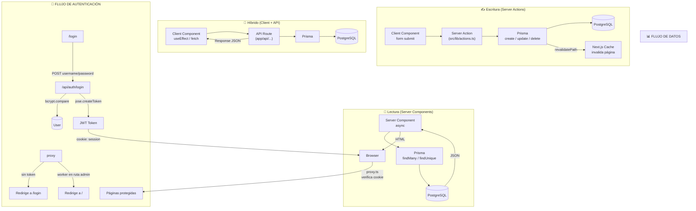
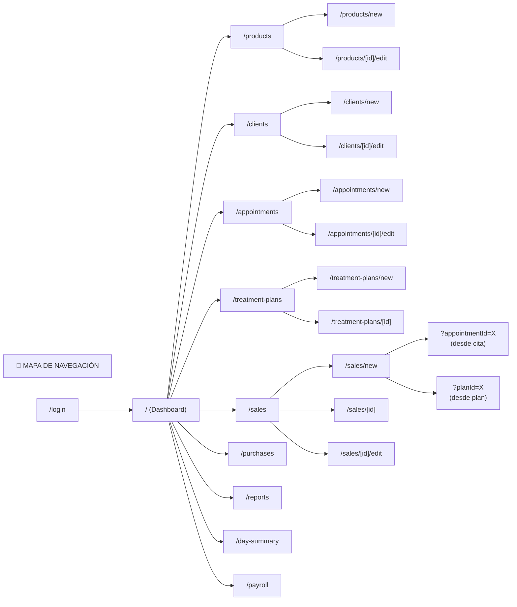
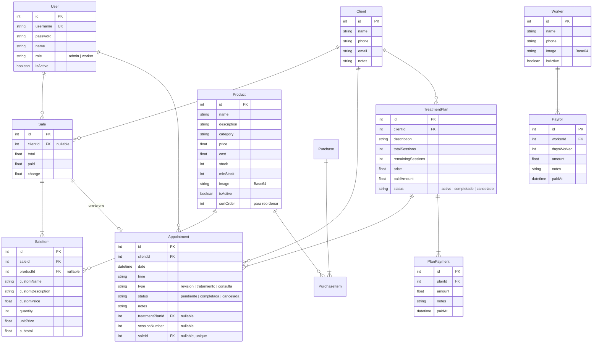

# Diagrama de Arquitectura — MASSS Cabellos

```mermaid
graph TB
  subgraph Usuario["👤 Usuario"]
    A[Admin / Trabajador]
  end

  subgraph Frontend["🖥️ Frontend — Next.js 16 App Router"]
    direction TB
    P1["/login<br/>Login page"]
    P2["/ (Dashboard)"]
    P3["/products<br/>Productos"]
    P4["/clients<br/>Clientes"]
    P5["/appointments<br/>Citas"]
    P6["/treatment-plans<br/>Planes"]
    P7["/sales<br/>Ventas"]
    P8["/purchases<br/>Compras"]
    P9["/reports<br/>Indicadores"]
    P10["/day-summary<br/>Resumen del Día"]
    P11["/payroll<br/>Nómina"]
    P12["/settings<br/>Configuración"]
    
    subgraph Shared["🧩 Componentes Compartidos"]
      C1["Sidebar<br/>Navegación"]
      C2["Header<br/>Barra superior"]
      C3["AssistantButton<br/>Botón asistente"]
      C4["DeleteButton<br/>Eliminar"]
      C5["CompleteButton<br/>Completar cita"]
      C6["ImageUpload<br/>Subir imagen"]
    end

    subgraph Factura["🧾 Factura"]
      S1["Página factura<br/>(/sales/[id])"]
      S1 --> S2["PDF Download<br/>jspdf"]
    end
  end

  subgraph API["⚙️ API Routes — Next.js"]
    direction LR
    R1["/api/auth/login"]
    R2["/api/auth/me"]
    R3["/api/auth/password"]
    R4["/api/auth/users"]
    R5["/api/products"]
    R6["/api/products/reorder"]
    R7["/api/clients"]
    R8["/api/appointments/[id]"]
    R9["/api/treatment-plans"]
    R10["/api/treatment-plans/payments"]
    R11["/api/upload"]
    R12["/api/payroll/*"]
    R13["/api/assistant"]
  end

  subgraph Middleware["🔒 Proxy Middleware"]
    M1["proxy.ts<br/>Verifica JWT<br/>Redirige a /login<br/>Restringe rutas admin"]
  end

  subgraph Database["💾 Base de Datos"]
    DB[("PostgreSQL<br/>Neon")]
    PR["Prisma ORM"]
    DB --- PR
    
    subgraph Models["📦 Modelos"]
      M2["User<br/>Product<br/>Client<br/>Appointment<br/>TreatmentPlan<br/>Sale<br/>SaleItem<br/>Purchase<br/>PurchaseItem<br/>Worker<br/>Payroll<br/>PlanPayment"]
    end
  end

  subgraph External["🌐 Servicios Externos"]
    G["Groq API<br/>Llama 3.3 70B"]
  end

  subgraph Deploy["🚀 Despliegue"]
    V["Vercel"]
    GH["GitHub"]
  end

  %% Conexiones
  A --> P1
  A --> P2
  A --> P3
  A --> P4
  A --> P5
  A --> P6
  A --> P7
  A --> P8
  A --> P9
  A --> P10
  A --> P11
  A --> P12

  P1 --> R1
  P2 --> PR
  P3 --> R5
  P3 --> R6
  P5 --> R8
  P6 --> R9
  P6 --> R10
  P7 --> S1
  P11 --> R12
  P12 --> R3
  P12 --> R4

  R1 --> PR
  R2 --> PR
  R3 --> PR
  R4 --> PR
  R5 --> PR
  R6 --> PR
  R7 --> PR
  R8 --> PR
  R9 --> PR
  R10 --> PR
  R12 --> PR

  C3 --> R13
  R13 ---> G

  Middleware -.->|Protege| P2
  Middleware -.->|Protege| P3
  Middleware -.->|Protege| P4
  Middleware -.->|Protege| P5
  Middleware -.->|Protege| P6
  Middleware -.->|Protege| P7
  Middleware -.->|Protege| P8
  Middleware -.->|Protege| P9
  Middleware -.->|Protege| P10
  Middleware -.->|Protege| P11

  GH -->|"git push"| V
  V -->|"Deploy"| Frontend
  V -->|"Deploy"| API
```



---



---



---

## 📐 Estructura de Carpetas

```
src/
├── app/
│   ├── api/
│   │   ├── appointments/[id]/    → GET cita individual
│   │   ├── assistant/            → POST chat con IA
│   │   ├── auth/
│   │   │   ├── login/            → POST login
│   │   │   ├── me/               → GET sesión actual
│   │   │   ├── password/         → PATCH cambiar contraseña
│   │   │   └── users/            → GET lista usuarios
│   │   ├── clients/              → GET clientes
│   │   ├── payroll/
│   │   │   ├── workers/          → CRUD trabajadoras
│   │   │   └── [id]/             → CRUD pagos nómina
│   │   ├── products/
│   │   │   ├── reorder/          → POST reordenar
│   │   │   └── [id]/             → GET/PUT producto
│   │   ├── treatment-plans/
│   │   │   ├── payments/         → POST/GET pagos plan
│   │   │   └── [id]/             → DELETE pago
│   │   └── upload/               → POST subir imagen
│   ├── appointments/             → Lista + CRUD citas
│   ├── clients/                  → Lista + CRUD clientes
│   ├── day-summary/              → Resumen del día
│   ├── login/                    → Página de login
│   ├── payroll/                  → Módulo nómina
│   ├── products/                 → Catálogo productos
│   ├── purchases/                → Compras
│   ├── reports/                  → Indicadores
│   ├── sales/                    → Ventas + factura
│   ├── settings/                 → Configuración
│   └── treatment-plans/          → Planes + pagos
├── components/
│   ├── sidebar.tsx               → Navegación lateral
│   ├── header.tsx                → Barra superior
│   ├── assistant-button.tsx      → Botón chat IA
│   ├── complete-button.tsx       → Completar cita
│   ├── delete-button.tsx         → Eliminar registro
│   └── image-upload.tsx          → Subir imágenes
├── lib/
│   ├── actions.ts                → Server Actions
│   ├── auth.ts                   → JWT create/verify
│   ├── logout.ts                 → Cerrar sesión
│   ├── prisma.ts                 → Cliente Prisma
│   ├── session.ts                → getCurrentUser
│   └── utils.ts                  → formatCurrency, etc.
├── generated/prisma/             → Prisma Client
└── proxy.ts                      → Middleware auth
```

---

## 📦 Modelos de Base de Datos


